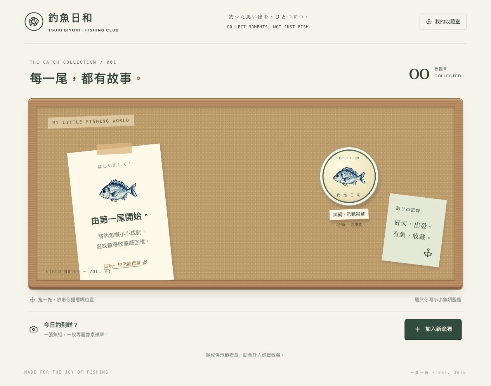

# 釣魚日和 · Tsuri Biyori

A personal fishing catch collection: upload a fish photo, turn it into a Japanese pixel-art badge, then place the badge on your corkboard.



## What it does

- Upload JPG, PNG, or WebP fish photos up to 10 MB.
- Generate a pixel-art fish badge that keeps the fish's silhouette and markings.
- Drag badges around the corkboard; their positions are saved automatically.
- Keep the original catch photo beside each generated badge.
- Store each catch under the signed-in user's account. New images live in authenticated Cloudinary storage and catch details live in D1. The image endpoint checks ownership before fetching an image; existing R2 images remain supported.
- Try the sample badge without adding it to the collection.

## Run locally

Requirements: Node.js 22.13 or later.

```sh
npm ci
cp .env.example .dev.vars
```

Add the three Cloudinary credentials and an OpenAI API key to `.dev.vars` to enable photo-to-badge generation. Image generation uses the OpenAI Images API and may incur usage charges. Keep `.dev.vars` private; it is ignored by Git. Sign-in is simulated by the local Sites preview. Run:

```sh
npm run dev
```

The development server prints its local URL. Use the preview's sign-in flow before opening the collection.

## Build

```sh
npm run build
```

This project uses Vinext and is set up for the Sites runtime. Production requires the D1 database and server-side `CLOUDINARY_CLOUD_NAME`, `CLOUDINARY_API_KEY`, `CLOUDINARY_API_SECRET`, and `OPENAI_API_KEY` secrets. Configure them in the hosting environment, never as `NEXT_PUBLIC_` values. The declared R2 binding is only used as a legacy fallback; no new R2 bucket is needed when Cloudinary is configured. No database migration is needed: Cloudinary references use the existing `source` and `image` columns. Existing R2 objects are not moved or deleted.

Cloudinary uploads use the authenticated delivery type with overwrite disabled. Failed saves roll back newly uploaded images. No unsigned upload preset, public image URL, paid add-on, or AI-generated test request is required.
