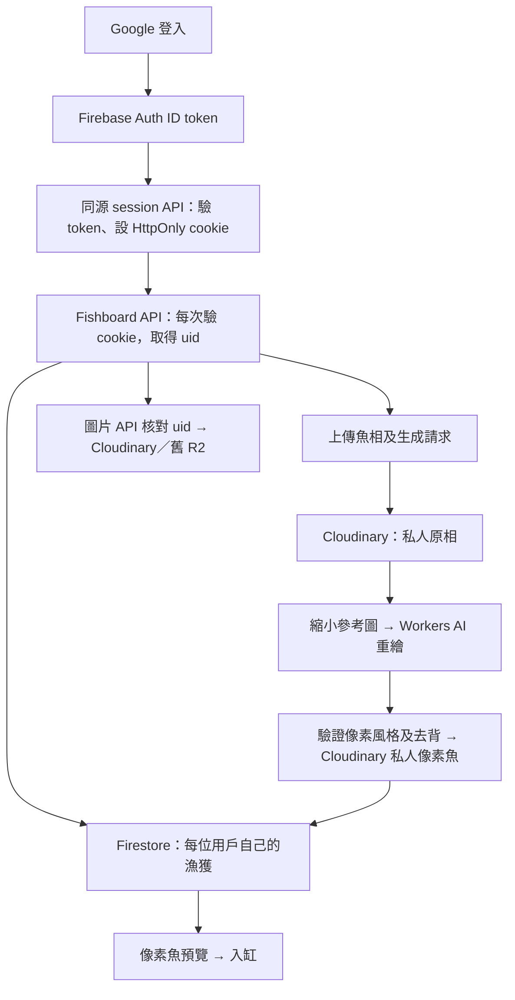

# Fishboard Firebase / Cloudinary / Workers AI Implementation Plan

> **2026-10-06 狀態更新：** 最新產品／UI 計劃見 `2026-10-06-fish-log-product-plan.md`。第一階段已改為無 Backend 的 mock-data v0.1；本文件的登入、資料庫、上傳及生圖工作全部後移。Firebase 或 Supabase 尚待選定，本文件只保留為原 Firebase 方案參考，不能直接按原 Task 1–6 開始執行。原先保留水背景／示範魚的 UI 約束由新規格取代。

> **For agentic workers:** REQUIRED SUB-SKILL: Use superpowers:executing-plans to implement this plan task-by-task. Steps use checkbox (`- [ ]`) syntax for tracking. This document is a plan only; implementation, provisioning and deployment have not started.

**Goal:** 將 fishboard 接入 Firebase Authentication 登入、Cloud Firestore 漁獲資料、Cloudinary 圖片儲存，以及 Cloudflare Workers AI 魚相重繪。

**Architecture:** 保留目前 React / Vinext / Cloudflare Workers 網頁與魚缸互動。Firebase 負責身份，Firestore 取代 D1；所有資料操作仍經同源後端 API，Cloudinary 繼續儲存原相與像素魚，Workers AI 取代 OpenAI 生圖。先驗證部署與生圖品質，再逐項切換，最後搬遷舊資料。

**Tech Stack:** TypeScript、React 19、Vinext、Cloudflare Workers / Workers AI、Firebase Web Auth SDK、Firestore REST API、Cloudinary HTTP API、Workers-compatible JWT library（建議 jose）。沿用 Node.js >=22.13.0。

**Spec:** 本文件「需求與第一版決策」及用戶 2026-10-06 的四項服務需求。

## Global Constraints

- 本次只寫計劃。現有未提交的 UI、圖片 API、README 及依賴修改需保留；執行時先重新檢查工作目錄。
- 不自動 commit / push；未有部署指示前不發佈。
- 保留目前水背景、魚缸排列、預覽、示範魚、圖鑑、動畫暫停與 reduced-motion 行為。
- 原相接受 JPG / PNG / WebP，最大 10 MiB；名字最多 50 字；釣獲日期以 Asia/Hong_Kong 使用的 YYYY-MM-DD 表示。
- 用戶身份只由驗證過的 Firebase token 得出，不能信任 body 的 uid / owner 或舊 oai-authenticated-user-* headers。
- 不將 Firestore service-account private key、Cloudinary secret 或 Cloudflare API token 放入瀏覽器、Git 或日誌。
- 原相與生成圖片保持私人；不將長效 Cloudinary signed URL 當成收藏 API 的回傳值。
- 不刪除 D1 / R2 舊資料；帳戶對應、備份、驗收完成後才考慮停用舊服務。

## Review Focus

1. 跨帳戶讀圖片／更新漁獲：回傳 404；不洩漏別人的資料或圖片 reference。
2. token 過期、登出或切換帳戶：私人 API 回傳 401；清除畫面及帳戶相關快取。
3. 生圖成功但 Cloudinary／Firestore 失敗：沒有半條收藏紀錄；清理失敗可追查及補做。
4. 重複提交或網絡重試：同一 requestId 不能再次生圖收費或產生重複收藏。
5. AI 改變魚種／花紋或未真正去背：不能當成完成；以參考相、透明度及魚缸實際顯示驗收。

---

## 需求與第一版決策

| 需求 | 第一版方案 | 分工 |
| --- | --- | --- |
| firebase login | Firebase Authentication，先做 Google 登入／登出 | 管理身份，提供 Firebase uid |
| firestone | Cloud Firestore，取代 D1 作為收藏資料主庫 | 保存名字、日期、圖片 reference、生成狀態 |
| cliudnary bucket storage | Cloudinary authenticated assets | 保存原相及像素魚；這是 Cloudinary 媒體資產儲存，毋須新增 Firebase Storage bucket |
| cloudflare worker ai image gen | Cloudflare Workers AI image editing | 用原魚相重繪，保留輪廓、魚鰭、顏色及花紋 |

以上是計劃的預設方向。Google 以外登入、公開分享、刪除收藏、魚種辨識、批量生圖及完整 job queue 不列入第一版。

## 已核對的項目現況

2026-10-06 本地核對：

- `app/page.tsx` 經 `requireChatGPTUser()` 保護，`app/chatgpt-auth.ts` 讀取 Sites 注入的身份 headers。
- `lib/catches.ts` 提供身份、binding、錯誤處理與對外圖片 URL；`app/api/catches/route.ts` 直接操作 D1。
- `POST /api/catches` 接收照片、呼叫 OpenAI Images edits、生圖後上傳兩張圖片，再寫入 D1。
- `lib/cloudinary.ts` 已有 authenticated upload、讀取、失敗 rollback；`app/api/images/[id]/route.ts` 先核對 owner 再取圖，兼容 R2。
- `app/api/catches/[id]/route.ts` 已有 x/y 更新；新資料層需保留相同範圍驗證。
- `app/collection.tsx` 在 POST 成功後已儲存收藏，再顯示像素魚預覽；「入缸」只改畫面，不是另一個儲存步驟。
- `vite.config.ts` 與 `.openai/hosting.json` 綁定現有 Sites / Cloudflare runtime；不是普通 Node.js Next.js server。
- 工作目錄已有未提交修改；此計劃不覆蓋任何應用程式檔案。

證據範圍：先用 codebase graph 查詢及追蹤 POST，coverage generation 為 `2026-10-05T08:49:57Z`。coverage 指出 collection、aquarium、water-background、README 有 freshness 差異，相關現況已改用當前 source 核對。沒有核對 Firebase / Cloudinary / Cloudflare 帳戶、付費方案、線上資料數量或正式部署。

## 目標流程

### 登入與後端權限

- 瀏覽器用 Firebase Web Auth SDK 登入，`onIdTokenChanged` 取得 token，送往 `POST /api/auth/session`。
- 後端驗證 RS256 signature、kid、aud、iss、exp、iat、auth_time、非空 sub，快取 Google public certificates 至官方 Cache-Control 到期。遵循 [Firebase token verification](https://firebase.google.com/docs/auth/admin/verify-id-tokens)。
- cookie 名稱 `fishboard_session`，存經驗證的短效 ID token；production 設 HttpOnly、Secure、SameSite=Lax、Path=/，期限不超過 token exp；local HTTP 可只在明確 development mode 關閉 Secure。
- 頁面與 `` 可使用 cookie。所有 API 每次重新驗證；登入未完成不先載入私人收藏。
- session 建立／清除及所有修改 API 要驗證預設網站 origin；production 缺少或不符 Origin 拒絕。登入同步失敗不將畫面標成已登入。切帳戶時 abort 舊請求及清空 items，避免舊請求遲到覆蓋新帳戶。
- 登出清 cookie、Firebase signOut 及本地畫面。ID token 驗證不等於即時撤銷檢查；被複製的 token 到期前可能仍有效。第一版不宣稱已實作「所有裝置即時登出」。

### Firestore 與資料形狀

主資料：`users/{uid}/catches/{catchId}`。

| 欄位 | 型別／用途 |
| --- | --- |
| id | string；保留既有 catchId |
| name / date | string；魚名及 YYYY-MM-DD 日期 |
| x / y | number；0..1，保留既有欄位兼容性 |
| source / image | string；現有 `cloudinary:...` 或舊 R2 reference |
| created / updated | Firestore timestamp；API 映射 created 為既有 ISO 字串 |
| model / promptVersion | string；記錄生成模型及風格版本；搬遷舊資料可為 null |

操作紀錄：`users/{uid}/generationRequests/{requestId}`，保存 status、catchId、startedAt、已上傳資產 references、cleanupPending、錯誤分類。status 用 `running / succeeded / failed / uncertain`；它不是收藏，只有 succeeded 的 catch 才進魚缸。

- 保持資料經後端讀寫，使用 service-account OAuth access token 呼叫 [Firestore REST API](https://firebase.google.com/docs/firestore/use-rest-api)。用 Workers fetch / Web Crypto，避免直接假設 firebase-admin 的 Node/gRPC 路徑可以部署。
- `firestore.rules` 預設拒絕所有 browser 直接讀寫。後端 service account 走 IAM，會繞過 Rules，所以每個 repository method 必須接受驗證過的 uid，固定該 uid 的 document path。
- service account 只給需要的 Firestore 資料權限；OAuth token 在 server 記憶體快取至到期前刷新。
- 列表按 created 升序，第一頁 50 筆；回傳 nextCursor，UI 提供載入更多。索引只加入實際查詢需要的項目。

### 生圖與儲存

- 候選模型：`@cf/black-forest-labs/flux-2-klein-4b`。官方確認支援參考圖片，使用 multipart `input_image_0`；參考圖需小於 512×512，計劃縮放至最長邊 511。見 [Cloudflare model input documentation](https://developers.cloudflare.com/changelog/post/2026-01-15-flux-2-klein-4b-workers-ai/)。
- 原相完整保存；縮圖由後端取原相後處理。先在 spike 驗證 authenticated Cloudinary 縮圖 delivery 能否使用，並配置受保護 derived asset；不要讓私人 URL 經 browser 或傳給不必要的服務。
- 風格延續目前設定：魚頭向左、全身、清楚像素塊、有限色盤、保留鰭與花紋；移除手、人、魚竿、文字及邊框。
- 不假設 FLUX 可以直接輸出可靠 alpha。spike 同時比較單色背景後的去背與可用的去背工具，確認完整 pipeline；如需額外收費的 Cloudinary add-on，列明成本與決策，不默認啟用。沒有合格透明像素魚前，不切換正式生圖。
- 原相／像素魚沿用 `fishboard/{catchId}/source`、`fishboard/{catchId}/badge`，兼容現有 reference parser；不要只在 folder 加 uid 而忘記 parser。
- 圖片 API 回傳 image bytes，私人 response 用 `Cache-Control: private, no-store`；SSR／收藏／session API 一律 no-store。
- 預設 synchronous 一次請求完成。spike 若無法在部署平台 timeout／memory 內完成，先修訂為可靠 queue + polling 方案，不用 waitUntil 假裝耐久 background job。
- 同 requestId 原子佔位，succeeded 回傳同一 catch、running 回 409、failed 需新 requestId 明確重試；uncertain 不自動重新生圖。provider timeout 無法保證沒有扣費。
- 建議首版限制每 uid 每日 10 次、每次只生成 1 張；UTC day boundary 作 quota key，UI 顯示香港時間重置時間。transaction 原子計數，請求送往 AI 前預留次數；AI call 不自動 retry。另設全站停用開關。
- 服務成本包含 Workers、Workers AI、Firestore 操作、Cloudinary storage／delivery／transformation。實作前核對 [Workers AI pricing](https://developers.cloudflare.com/workers-ai/platform/pricing/) 及帳戶方案；本計劃不承諾完全免費。

## 檔案分工

| 檔案 | 工作 |
| --- | --- |
| 新 `lib/firebase-client.ts`、`app/auth-provider.tsx`、`app/login/page.tsx` | Firebase client 初始化、登入、token 同步及切帳戶 |
| 新 `lib/firebase-auth.ts`、`app/api/auth/session/route.ts` | Workers token 驗證及 cookie 建立／清除 |
| 改 `app/page.tsx`、`app/layout.tsx`、`app/collection.tsx`、`lib/catches.ts` | 接入 Firebase session、登入／登出與 uid |
| 新 `lib/firestore.ts`、`lib/catch-repository.ts`、`lib/catch-types.ts` | server OAuth、Firestore REST、uid 範圍 CRUD 及 API 型別 |
| 新 `firestore.rules`、`firestore.indexes.json`、`firebase.json` | 直接存取策略、索引及 emulator 設定 |
| 改三個既有 catches／images API route | D1 改 Firestore；保留回傳形狀與 R2 圖片 fallback |
| 改 `lib/cloudinary.ts` | 私人縮圖及可靠清理；沿用現有資產格式 |
| 新 `lib/fish-generation.ts`、`lib/generation-requests.ts` | Workers AI adapter、requestId／quota／操作狀態 |
| 改 `vite.config.ts`、`cloudflare-env.d.ts`、`.env.example`、`package.json` | AI binding、Firebase 設定與依賴；不能手改 dist 產物 |
| 新 `scripts/migrate-catches.mjs`、`scripts/reconcile-generation.mjs` | 可重跑搬遷及失敗清理；node script 不放入 frontend bundle |
| 新 `tests/firebase-auth.test.mjs`、`tests/firestore.test.mjs`、`tests/firestore-rules.test.mjs`、`tests/generation.test.mjs`；改既有 storage tests | 身份、權限、重試及儲存失敗驗證 |
| 新 `docs/service-setup.md`；改 `README.md` | 帳戶設定、部署、成本限制、搬遷及 rollback 操作 |

先沿用 `node --test`。若 TS 模組載入需 compile fixture，沿用既有 tests 的方式；Firestore Rules tests 由 Firebase Emulator 執行。

## Task 1：部署與生圖可行性驗證

**Files:** 新 `docs/service-setup.md`；檢查 `vite.config.ts`、`build/sites-worker.ts`、`build/sites-vite-plugin.ts`、`.openai/hosting.json`；spike adapter 最後歸入 `lib/fish-generation.ts`。

**Interfaces:** 輸出 hosting 決定、AI 輸入／輸出格式、縮圖／去背 pipeline 及 timeout／memory 驗證結果，供 Task 4 使用。

- [ ] 查明現有 Sites 發佈是否強制 ChatGPT gate，以及能否配置 AI binding／server secrets。若平台不能提供獨立 Firebase 登入，沿用 Vinext app 改為直接 Cloudflare Worker 部署；不順便重寫網站框架。
- [ ] 驗證 Firebase Web SDK public config 在此 Vinext build 的注入方式；`NEXT_PUBLIC_*` 必須真的出現在 client build，不能假設只設 Worker runtime secret 即可。
- [ ] 配置 staging Firebase 專案／Google provider／authorized domains、Firestore region、Cloudinary product environment、Workers AI binding；記錄設定名稱，secret 只透過環境設定輸入。
- [ ] 用 5 張可使用的魚相驗證：黑色魚、淺色魚、條紋魚、手持魚、雜亂背景。記錄輸入尺寸、provider latency、完整 request 時間、失敗及每張估計成本。
- [ ] 每張人工核對魚形、主要花紋、完整魚鰭、向左、像素風格、去除非魚元素；自動檢查圖片可 decode、具有非全透明魚身及透明背景。全部通過才選定模型／去背實作。
- [ ] 輸出 GO／NO-GO：部署可用、私人縮圖可用、生圖品質過關、資源限制內完成。任何未過項目須修訂本計劃再進 Task 4。

**驗收:** 可重現的完整 image pipeline，以及一份確定的 hosting／設定清單；單看模型文件不能算完成。

## Task 2：Firebase 登入與私人 session

**Files:** 檔案分工表內 Auth 檔案、`app/page.tsx`、`app/layout.tsx`、`app/collection.tsx`、`lib/catches.ts`、Auth tests。

**Interfaces:** `verifyFirebaseIdToken(token: string): Promise<{uid: string; email: string|null; expiresAt: number}>`；`getFirebaseUser(): Promise<FirebaseUser|null>`；`requireFirebaseUser(returnTo: string): Promise<FirebaseUser>`。`POST /api/auth/session` 接收 `{idToken}`，回 `{user:{uid,email}}`；`DELETE` 清 cookie。

- [ ] 寫測試：正確 token 回 uid；錯 signature／aud／iss／過期／空 sub 回 401；跨 origin 回 403；缺 cookie 回 401；偽造舊身份 headers 無效。先執行 `node --test tests/firebase-auth.test.mjs` 確認新功能未實作時失敗。
- [ ] 實作 verifier、certificate cache 及 session API；依前述 cookie／origin 決策處理。
- [ ] 實作 Google 登入、token 更新同步、登出，頁面改用 Firebase guard；收藏 request 在 session ready 後才發出。
- [ ] 加切帳戶測試：A 的延遲 response 不可出現在 B 畫面；Auth token 更新而 session 同步失敗時保留登入錯誤、不能繼續私人操作。
- [ ] staging 瀏覽器验证：登入、refresh、直接開圖片、過期後刷新、登出、Google popup 被阻擋時的 redirect fallback。

**驗收:** 網页與 image endpoint 共用 Firebase 身份，沒有依賴 Sites mock user。

## Task 3：Firestore 收藏資料及權限

**Files:** Firestore／repository／types 檔案、rules／indexes／firebase config、既有 GET／PATCH／images routes、Firestore tests。

**Interfaces:** `listCatches(uid, {limit:50,cursor?}) → Promise<{items:CatchRecord[],nextCursor:string|null}>`；`getCatch(uid,id) → Promise<CatchRecord|null>`；`createCatch(uid,record) → Promise<CatchRecord>`；`updatePosition(uid,id,{x,y}) → Promise<void>`。API 保持 `{items,generationReady,nextCursor}`、`{item}`、`{saved:true}` 及現有 `/api/images/{id}` URL。

- [ ] 寫測試：A 不可讀取／更新 B 的 id；列表 pagination 不重複／漏掉同 timestamp 記錄；x/y 越界回 400；錯誤日期如 2026-02-30 回 400。先跑 `node --test tests/firestore.test.mjs` 確認失敗。
- [ ] 實作 OAuth token cache、Firestore codec 及 repository，list 按 created + id 穩定排序，所有查詢由 uid path 限制。
- [ ] 改 GET／PATCH／圖片查詢，保留 legacy R2 reference。圖片缺失回 404，配置缺失回 503；前端增加載入更多。
- [ ] 寫並跑 Rules emulator 測試，authenticated／unauthenticated browser 都不能直接讀寫。測試 IAM 後端的 owner 隔離，不能用 Rules tests 代替。
- [ ] 在 staging 保存兩個用戶的 fixture，驗證互相不能列出、取得或更新對方收藏及圖片。

**驗收:** 收藏讀取與位置更新走 Firestore，uid 隔離與私人圖片一致。

## Task 4：Workers AI、Cloudinary 與一次性生成

**Files:** generation 檔案、`lib/cloudinary.ts`、`app/api/catches/route.ts`、`app/collection.tsx`、binding／env 設定、generation／storage tests。

**Interfaces:** `generateFishBadge(env, source:Blob): Promise<{image:Blob,model:string,promptVersion:string}>`；`createGeneratedCatch(uid,requestId,input): Promise<CatchRecord>`。POST multipart 保留 image/name/date，新增 requestId UUID；成功仍回 201 `{item}`，同 id 已完成回 200 相同 item，running／uncertain 回 409。

- [ ] 寫測試：requestId 重複只 call AI 一次；quota 第 11 次回 429；超限／偽裝 MIME 圖片在任何 AI／storage call 前回 400 或 413；AI 429／timeout 不盲目重試。
- [ ] 實作 Firestore 原子 request claim／quota，從 server 建 catchId；設定缺失先回 503。upload body 除 content-length 外仍需受限讀取，decode 驗證真實格式與像素尺寸，防止空檔案或超大解碼圖片。
- [ ] 按 Task 1 已驗證 pipeline 實作縮圖、`env.AI.run` multipart、output decode、去背／像素風格驗證與 Cloudinary authenticated uploads；移除正式路徑對 OPENAI_API_KEY 的依賴。
- [ ] 將 catch create 與 request succeeded 用同一 Firestore commit 完成。失敗前已上傳的資產逐一清理；清理失敗設 cleanupPending。provider／commit outcome 不明時標 uncertain，先 reconcile，不當成必定未儲存。
- [ ] 寫故障測試：原相成功後 AI 失敗、第二張 upload 失敗、Firestore 明確拒絕、Firestore 已 commit 但 response 丟失、destroy API 失敗。後者不能刪掉已成功收藏引用的圖片。
- [ ] `scripts/reconcile-generation.mjs` 查 running／uncertain／cleanupPending；先核對 catch 與 request，再修復狀態或清理未引用資產；dry-run 列動作，apply 可重跑。中途 Worker 終止用這條路徑恢復，不重新生圖。
- [ ] UI 沿用「生成 → 預覽 → 入缸」；顯示真實 loading／失敗訊息，失敗不加入虛構像素魚。`generationReady` 只在完整 pipeline、credentials、AI binding 及 feature flag 就緒時為 true。
- [ ] 跑 `npm test`、`npx tsc --noEmit`、`npm run build`，再做 staging 真實魚相驗收；mock 測試通過不能代替 AI 品質驗收。

**驗收:** 原相重繪並保存兩張私人圖片，收藏只有一份，失敗可恢復，畫面維持原有魚缸體驗。

## Task 5：D1 舊資料搬遷與帳戶對應

**Files:** `scripts/migrate-catches.mjs`、搬遷 tests、`docs/service-setup.md`。owner mapping／exports 保存於 ignored 私人目錄。

**Interfaces:** `node scripts/migrate-catches.mjs --input <export.json> --owner-map <map.json> --dry-run`；核對後用 `--apply`。mapping 為 `{legacyOwnerId:firebaseUid}`，document id 沿用 catch id。

- [ ] 先匯出 D1 並備份，清點每個 owner／catch id／source／image 的數量与完整性。
- [ ] 以管理者可信方式確認舊 owner → Firebase uid；不能單靠用戶自報 email 或 body 的舊 owner 取回資料。沒對應的資料留在備份與 exception report，不猜測、不轉給第一個登入帳戶。
- [ ] 寫測試：相同 export 重跑不新增／覆蓋已修改的收藏；未知 owner 只報例外；legacy R2／Cloudinary references 原樣保留；時間格式轉換可追查。
- [ ] dry-run 檢查 path、逐 owner 數量及例外；apply 採 create-only 寫入，不用 overwrite upsert；核對 doc 數量、原相及像素魚可讀。
- [ ] 小項目先用短 maintenance window 暫停舊庫寫入，匯出最後一次資料後切換；避免同時新增到兩庫導致資料分叉。
- [ ] rollback 保留舊部署與資料。若新系統已產生寫入，先暫停寫入、匯出 Firestore 新增／更新並對賬，不能直接切回舊 D1 丟失新收藏。

**驗收:** 所有已對應用戶的紀錄和圖片可讀，未對應資料有明確報告，舊儲存可恢復。

## Task 6：整合、部署及最終驗收

**Files:** `README.md`、`docs/service-setup.md`、部署設定及驗證紀錄。

**Interfaces:** 沿用 Tasks 2–4 的身份、API 及 catch schema；這階段不新增 API 行為。

- [ ] 更新設定清單：client Firebase apiKey／authDomain／projectId／appId；server FIREBASE_PROJECT_ID／FIREBASE_CLIENT_EMAIL／FIREBASE_PRIVATE_KEY；Cloudinary 三項設定；AI binding；WORKERS_AI_MODEL；GENERATION_ENABLED；FISHBOARD_ORIGIN。Firebase web apiKey 是公開設定，不等同 server secret。
- [ ] 在乾淨 install 後執行 `npm test`、`npx tsc --noEmit`、`npm run build`、`npm run lint`；Rules 使用 `npx firebase-tools emulators:exec --only firestore "node --test tests/firestore-rules.test.mjs"`。Firebase CLI／Rules testing package 放 devDependencies 並鎖版本。
- [ ] staging 做完整流程：Google 登入 → 新增魚相 → AI 重繪 → 預覽 → 入缸 → refresh → 原相／像素魚詳情 → 登出；再用第二帳戶驗證隔離。
- [ ] mobile Safari／Chrome 檢查登入 redirect、圖片 cookie、loading、超時訊息、示範魚及 reduced-motion；清楚區分自動測試與真實裝置驗收。
- [ ] 設定 quota、全站停用開關、成本通知及失敗日誌；記錄 requestId／uid／model／階段／duration，不記錄 token、原相 bytes、secret 或私人 signed URL。成本通知不是硬性費用上限。
- [ ] 依 Task 1 選定部署路徑，在有發佈指示後切換 production；驗證正式 authorized domain、secrets、AI binding、Rules／IAM、舊圖片及來源數量。

**Definition of done:** 四項服務在正式環境共同工作、跨帳戶隔離成立、透明像素魚品質通過、資料搬遷對賬及失敗恢復已驗證；只有本地 build 成功不可稱為已完成上線。

## 執行次序與待決事項

執行順序：Task 1 可行性 → Task 2 登入 → Task 3 Firestore → Task 4 Workers AI → Task 5 搬遷 → Task 6 整合與部署。

開始實作時需要確認：Firebase／Cloudinary／Cloudflare 專案及環境、舊 owner 對應 Firebase uid、可接受的生圖成本、Task 1 的透明背景方案。這些不阻止本計劃完成，但會影響 provisioning、生圖試驗及正式切換。

本次完成的是計劃文件；沒有建立雲端服務、呼叫收費生圖、修改應用程式、搬遷資料或部署。
